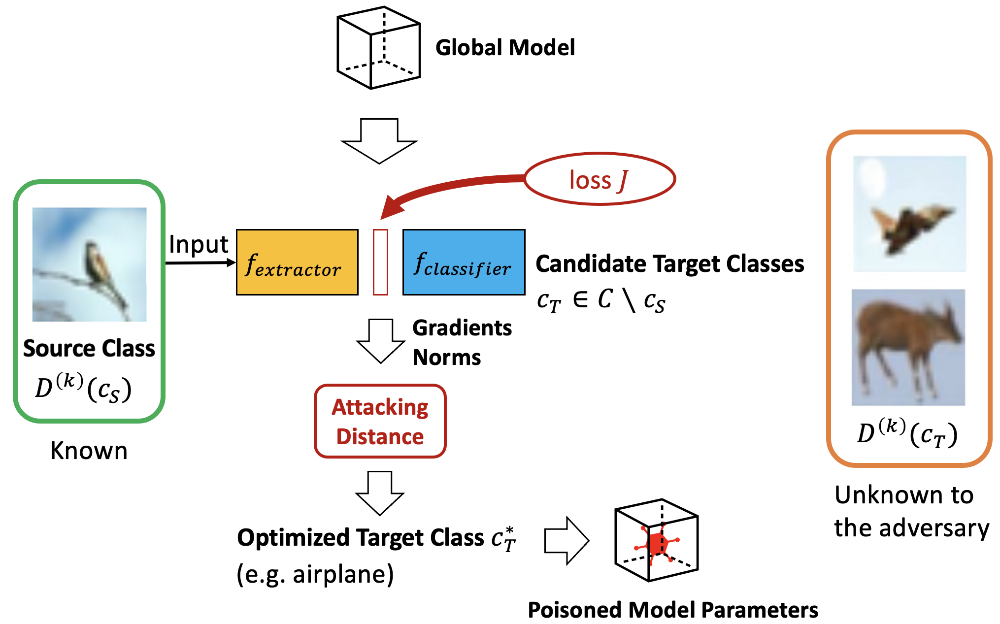

## Tensorflow implementation of Attacking Distance-aware Attack (ADA)

[Semi-Targeted Model Poisoning Attack on Federated Learning via Backward Error Analysis](https://arxiv.org/abs/2203.11633) at IJCNN 2022

[Attacking Distance-aware Attack: Semi-targeted Model Poisoning on Federated Learning](https://www.techrxiv.org/articles/preprint/How_the_Target_Matters_Semi-Targeted_Model_Poisoning_Attack_on_Federated_Learning/20339091) at IEEE Transactions on Artificial Intelligence 2023

## Table of Contents
* [General information](#general-information)
* [Running the systems](#running-the-systems)
* [A new survey paper](#a-new-survey-paper)

## General information
Attacking Distance-aware Attack (ADA) enhances a poisoning attack by finding the optimized target class in the feature space.

<center>
</img>
</center>
   
This instruction describes how to mount the semi-targeted ADA attack and other baseline attacks on five different benchmark datasets, i.e., MNIST, Fashion-MNIST, CIFAR-10, CIFAR-100, and ImageNet. There are three model architectures that can be applied for federated learning, that is, 2-layer CNNs, VGG16, and VGG19.

## Running the systems
### Environment
Tensorflow 2

Python 3.8

### Download the pretrained model weights
Attack was mounted when the federated learning was converged. Please first download the pretrained model weights below.

Google Drive: [Pretrained model datasets](https://drive.google.com/file/d/1HfChT3hS-WBkMu82fE8bNKEqsDwoBqzZ/view?usp=sharing) 

### Mounting attacks
#### Semi-targeted ADA attack
To run the algorithm with the optimized target class that was prepared beforehand:

	python main.py --dataset cifar10 --model vgg16 --ndc --seed 0 --epsilon 0.1
	
#### "Train and scale" attack

	python main.py --dataset cifar10 --model vgg16 --ndc --seed 0 --epsilon 0.1 --ada

#### Label Flipping attack	
	
	python main.py --dataset cifar10 --model vgg16 --ndc --seed 0 --epsilon 0.1 --ada --scale

### Obtain the pretrained model weights

In case, you would like to use a different model architecture and train the model from scratch:
	
	python pretraining.py --dataset cifar100 --model vgg16 --epoch 5 --batch 128 --sample 500
	
where you can choose the dataset, model architecture, local training epoch, and local batch size that you want to use. The learned model weights will be saved for mounting the ADA attack.

### Flame 
In case that you would like to compute from scratch the optimized target class using FLAME:

	python main.py --dataset cifar10 --model vgg16 --ndc --seed 0 --epsilon 0.1 --flame

## Citation 
If this repository is helpful for your research or you want to refer the provided results in this work, you could cite the work using the following BibTeX entry:

```
@article{sun2022semitarget,
  author = {Yuwei Sun and Hideya Ochiai and Jun Sakuma},
  title = {Semi-Targeted Model Poisoning Attack on Federated Learning via Backward Error Analysis},
  journal = {International Joint Conference on Neural Networks (IJCNN)},
  year = {2022}
}
```

## A survey paper

We have a survey paper on decentralized deep learning regarding security and communication efficiency, published in IEEE Transactions on Artificial Intelligence, December 2022.

[Decentralized Deep Learning for Multi-Access Edge Computing: A Survey on Communication Efficiency and Trustworthiness](https://ieeexplore.ieee.org/document/9645169).
